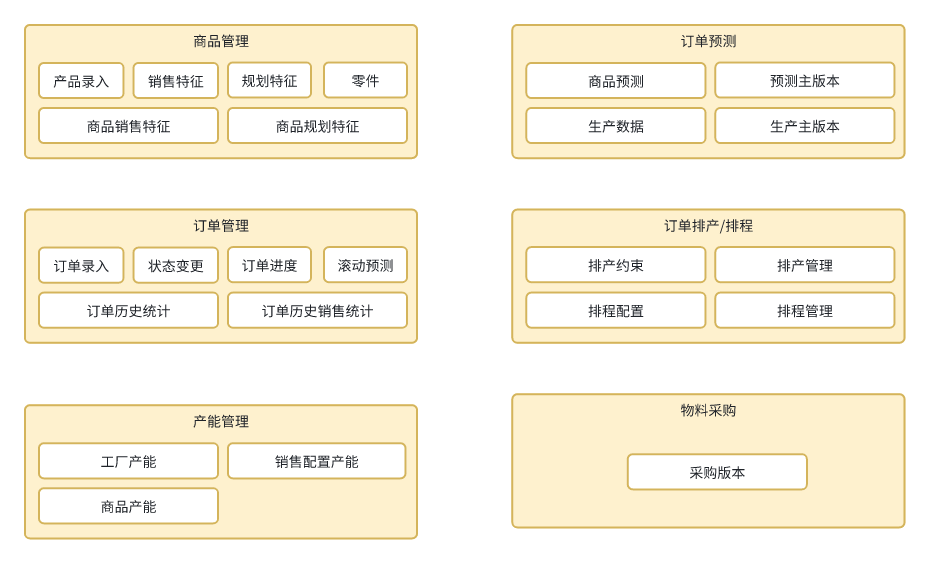

# peanut 门户组成部分

## aps 高级排产排程模块

1. 产品预测
2. 订单管理
3. 订单排产
4. 订单排程

## 模块功能如下：


# 项目说明

该模块可以单独启动， 也可以配合 peanut-portal增加多个模块一起启动。  
单APS启动为启动 tmp.APSBootstrapApplication

如需单独打包启动，增加spring-boot打包插件

```xml

<plugin>
  <artifactId>spring-boot-maven-plugin</artifactId>
  <configuration>
    <includeSystemScope>true</includeSystemScope>
  </configuration>
  <groupId>org.springframework.boot</groupId>
</plugin>

```
# 二开手册


# 订单部分

| 功能点      | 路径                                            | 开发事项                    |
|----------|-----------------------------------------------|-------------------------|
| 订单创建     | /apsOrder/insert                              | 自己实现订单录入 ,或接入MQ接收订单     |
| 订单状态变更   | /apsOrder/updateOrderStatus                   | 可以接入MQ对接该接口             |  
| 历史订单汇总   | /apsOrderGoodsHistory/selectOrder2History     | xxl-job 接入   ，支持当前月，上个月 |  
| 历史销售配置汇总 | /apsOrderGoodsSaleHistory/selectOrder2History | xxl-job 接入   ，支持当前月，上个月 |  

# 排产

| 功能点    | 路径                                   | 开发事项                                  |
|--------|--------------------------------------|---------------------------------------|
| 排产约束条件 | apsSchedulingConstraints/getUseField | 增加自己的逻辑条件                             |                             |
| 排产下发   | /apsSchedulingIssueItem/insert       | 确认当天生产订单,后续进行排程操作, 可以对接第三方,进行订单排产下发确认 |

# 排程

| 功能点 | 路径 | 开发事项 |
|-----|----|------|
 
